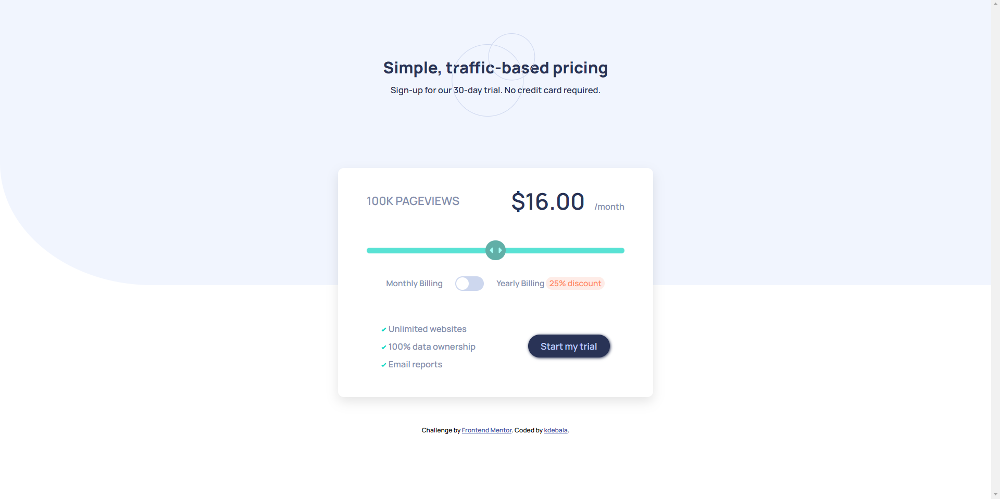
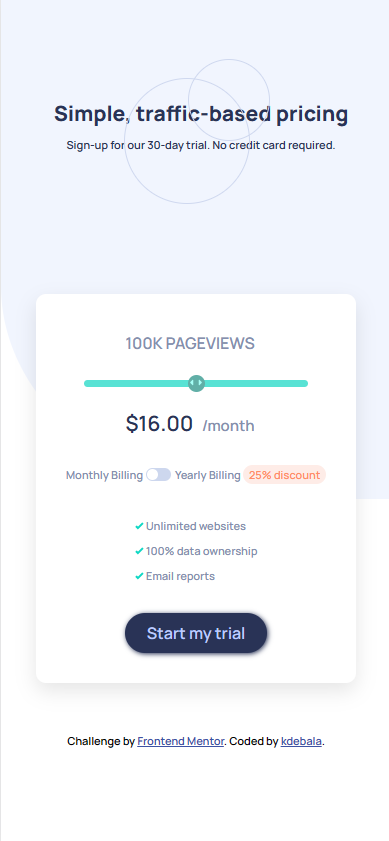

# Frontend Mentor - Interactive pricing component solution

This is a solution to the [Interactive pricing component challenge on Frontend Mentor](https://www.frontendmentor.io/challenges/interactive-pricing-component-t0m8PIyY8). Frontend Mentor challenges help you improve your coding skills by building realistic projects.

## Table of contents

- [Overview](#overview)
  - [The challenge](#the-challenge)
  - [Screenshot](#screenshot)
  - [Links](#links)
- [My process](#my-process)
  - [Built with](#built-with)
  - [What I learned](#what-i-learned)
- [Author](#author)

## Overview

### The challenge

Users should be able to:

- View the optimal layout for the app depending on their device's screen size
- See hover states for all interactive elements on the page
- Use the slider and toggle to see prices for different page view numbers

Page view and pricing totals
Here are the different page view ranges and the corresponding monthly price totals:

- 10K pageviews / $8 per month
- 50K pageviews / $12 per month
- 100K pageviews / $16 per month
- 500k pageviews / $24 per month
- 1M pageviews / $36 per month

If the visitor switches the toggle to yearly billing, a 25% discount should be applied to all prices.

### Screenshot

<table>
        <tr>
		    <td>
                
            </td>
			            <td>
                
            </td>
        </tr>
</table>

### Links

- Solution URL: [See my code](https://github.com/kdebala/interactive-pricing-component)
- Live Site URL: [Check it out here](https://kdebala.github.io/interactive-pricing-component/)

(<a href="#top">back to top</a>)

## My process

### Built with

- Semantic HTML5 markup
- CSS custom properties
- Flexbox
- CSS Grid
- SASS
- Media Query
- JavaScript

### What I learned

In this project I had a chance to test my knowledge about SASS. Also, for the first time I was using toggle switch and input range and it was quite challenging for me.

## Author

- Github - [kdebala](https://github.com/kdebala)
- LinkedIn - [@Katarzyna Dębała](https://www.linkedin.com/in/kdebala)

(<a href="#top">back to top</a>)

